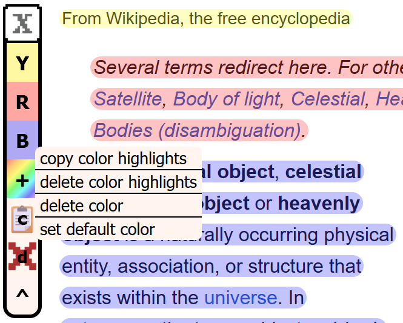
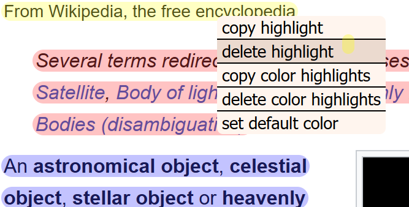

[![stars][stars-shield]][stars-url]
[![issues][issues-shield]][issues-url]
[![license][license-shield]][license-url]

 

  
  <h3 align="center">xtohighlight</h3>
  

    A simple Firefox WebExtension for making and managing Highlights
     
    <a href="https://github.com/dopmore/xtohighlight/blob/main/README-IMAGES/showcase.mp4">View Demo</a>
    &middot;
    <a href="https://github.com/dopmore/xtohighlight/issues/new?labels=bug&template=bug-report---.md">Report Bug</a>
  

## About the project

I created xtohighlight because most WebExtension for highlighting were either ugly or overly complex for my use case. Xtohighligt is inteded to mimic the feel of marking a text on paper while adding features like deleting and copying highlights independantly or based on color.

## Getting Started

### Installing
Integration into Firefox Browser Add-Ons coming soon...

#### Testing locally
As the WebExtension is pending verification by AMO (addons.mozilla.org), you can currently only temporarly load the plugin by:
1. downloading the CODE archive
2. going to about:debugging
3. clicking Load Temporary Add-On..
4. selecting the manifest.json in CODE

### User-Guide
### The highlighter   
The WebExtension uses a independant mode for highlighting that can be toggled on and off by pressing x.

In the highlighting-mode the cursor changes to a highlighter and highlights become visable. Additionally a toolbar appears that allows for quick-actions.

### The toolbar
The toolbar allows you to select the current color for highlighting, adding / deleting colors and copying / deleting highlights.

Each color displays the corresponding keyboard shortcut, that can be used instead of clicking the color on the toolbar.

Right clicking on a color opens a context-menu for copying / deleting highlights with that color and deleting or setting that color as the default.

The toolbar can be minimized / maximized by single clicking the logo or the arrow-up button on the bottom. It can be dragged around by clicking on the logo

### The custom context-menu

Right clicking on a single highlight, anywhere on a webpage or a color in the toolbar reveals a custom context-menu that allows for quick-actions like copying / deleting etc.

### Shortcuts

The main shortcuts are
- "x" for toggling the highlighter,
- "d" for deleting all highlights,
- "c" for copying all highlights

and any keys assigned to colors for switching to that color (If pressed twice it will copy all highlights of that color).

## Development

This project only uses native javascript and css.

[stars-shield]: https://img.shields.io/github/stars/dopmore/xtohighlight
[stars-url]: https://github.com/dopmore/xtohighlight/stargazers
[license-shield]: https://img.shields.io/github/license/dopmore/xtohighlight
[license-url]: https://github.com/dopmore/xtohighlight/blob/master/LICENSE.txt
[issues-shield]: https://img.shields.io/github/issues/dopmore/xtohighlight
[issues-url]: https://github.com/dopmore/xtohighlight/issues
